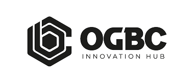
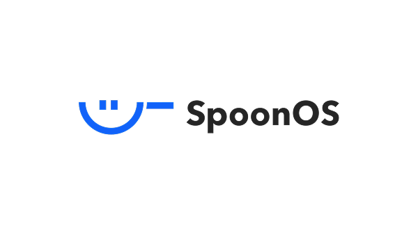



# SPARK AI Hackathon

<!-- [English](/docs/README_EN-US.md) | [简体中文](/docs/README_ZH-CN.md) -->

<!-- 
📌 占位符说明：
- [BANNER_IMAGE_PATH] - 活动主视觉图片路径
- [ACTIVITY_THEME] - 活动主题
- [REGISTRATION_FORM_LINK] - 报名表单链接
- [VIDEO_TUTORIAL_BILIBILI] - Bilibili 教程视频
- [VIDEO_TUTORIAL_YOUTUBE] - YouTube 教程视频
- [ZOOM_LINK] - Demo Day Zoom 链接
-->

☄当 AI 撞击 Web3，让创意真正落地！

**SPARK AI Hackathon** 是一场面向所有人的 **休闲黑客松（Casual Hackathon）**。

## 🗓️报名方式与日程安排（Registration & Schedule）

赛事总览：1 月 26 日 – 2 月 1 日；全程线上。

这里不比通宵、不拼履历、不设隐形门槛——我们关心的，从来不是你写了多少行代码，而是你的想法，是否真的能点燃火花。

以下活动链接入口都会在活动群及时预告，如果此界面无法入会请加入活动群~

| 活动 (Event)            | 时间 (Time UTC+8)                                                           | 形式 (Format)                                    | 相关链接 (Link)                                                                                                                                                                                                                                                                |
| ----------------------- | --------------------------------------------------------------------------- | ------------------------------------------------ | ------------------------------------------------------------------------------------------------------------------------------------------------------------------------------------------------------------------------------------------------------------------------------ |
| 🗓 Open Day (开幕)      | 1月28日 19:00-20:30                                                         | 📍 Zoom   📍 Twitter 直播</nobr>                                          | [Zoom 链接](https://us06web.zoom.us/j/82510601772?pwd=2MtYQkfkFOIUsz98wb4lrzcdMQO1iB.1)   [X 直播链接](https://x.com/i/broadcasts/1yoJMPZZkkOGQ) |
| 💻 Co-building (开发期) | 1月29日 19:00-20:00    1月30日 14:00-15:00    1月31日 18:30-19:30 | *Hacking Time!* | [Zoom 链接](https://us06web.zoom.us/j/84019245134?pwd=IgtZadqIZLuzHtPCgNphzcSbu8nigS.1)    [Zoom 链接](https://us06web.zoom.us/j/88224933555?pwd=qraz4AfI4Xb86JDyTjWviab2bKuBpm.1)    [Zoom 链接](https://us06web.zoom.us/j/82971130369?pwd=ii6CAY79mibBunwAz3lIw4ar8Kx37m.1) |
| 🛠 Tech Workshop        | 1月29日 20:30-22:00                                                         | 📍 Zoom   📍 Twitter 直播</nobr>                                          | [Zoom 链接](https://us06web.zoom.us/j/84292630277?pwd=I2hqeQAvFnOCXaAKY1tLxmd9aeWR1a.1)   [X 直播链接](https://x.com/i/broadcasts/1YqKDNokRPeJV) |
| 💬 AMA                  | 1月30日 18:30-19:30                                                         | 📍 Twitter Space                                 | [Space 链接](https://x.com/i/broadcasts/1zqKVdPPLOlJB)                                                                                                                                                                                                                            |
| 📥 Demo 提交截止        | 2月1日 中午 12:00                                                           | 📍 GitHub Issue                                  | [👉 点击此处提交 Demo](https://github.com/CasualHackathon/SPARK-AI-Hackathon/issues/new?template=submission.md)                                                                                                                                                                   |
| 🏁 Demo Day (路演)      | 2月1日 19:00-22:00                                                          | 📍 Zoom   📍 Twitter 直播</nobr>                                          | [Zoom 链接](https://us06web.zoom.us/j/86782028304?pwd=wfBDRXFhKM5R9ijUMN2QLWXwk6wTxq.1)   [X 直播链接](https://x.com/i/broadcasts/1vOGwdMrvVrJB) |
| 🏆 获奖公示 (Awards)    | 2月4日                                                                      | 📍 社区公告                                      | X 链接（待更新）                                                                                                                                                                                                                                                               |

**报名入口：** [点击报名](https://github.com/CasualHackathon/SPARK-AI-Hackathon/issues/new?template=register.md)

**Demo 提交入口：** [提交 Demo](https://github.com/CasualHackathon/SPARK-AI-Hackathon/issues/new?template=submission.md)

**报名教程说明：** [查看报名教程](CONTRIBUTING.md#01--报名教程视频registration-tutorial)

**报名/提交概览：**

<!-- Registration summary start -->
报名人数：64｜提交人数：1（名单详见 `CONTRIBUTING.md`）
<!-- Registration summary end -->

**赛事交流群：群聊已满 200 人，需添加运营人员微信，备注 SparkAI ，邀请入群： clynn2024**

## **01 | 参赛规则与激励（Participation Rules & Incentives）**

### **👥 组队建议**

- **人数限制**: 每支参赛队伍成员人数**不超过5 人**。
- **自由组合**: 支持参赛者跨背景、跨领域自由组队。
- **全面开放**：本次活动全面开放参赛通道，无论是否为实习计划成员，人人均可参与。
- **Non-Coder 友好建议**：鼓励类似“产品经理 + 开发工程师 + UI 设计师”的跨界组合；即使不会代码，也可以负责产品设计与逻辑规划，利用 AI 工具将想法真正落地。

### **🎁 奖项和奖励**

本次休闲黑客松总奖金池高达 **$2,500 USDT**，覆盖 3 个核心赛道，具体奖金金额将根据最终参赛项目情况进行调整。所有参赛者团队都有机会**瓜分总奖金池**，并可获得由 LXDAO 颁发的**专属创意 Badge NFT**。

获奖项目不仅可以获得**奖金和荣誉**，还将有机会进入获奖赛道的**长期生态孵化**，**官方推广、合作伙伴曝光以及开发资源支持**。

- **实习计划学员**可额外获得学分奖励（例如：第一名 +100 学分，后续获奖者 +50 学分）。
- **Permissionless 学员及外部参赛者**将重点获得奖金与荣誉勋章，无学分奖励。

## **02 | 三大赛道介绍 (Tracks & Resources)**

本次黑客松共设立三个核心赛道，你可以根据兴趣**选择其一**进行挑战。

### **1.**  [**Kite AI**](https://x.com/GoKiteAI) -**支付 (Payment Track)**

**🎯 核心目标：**探索 AI/Agent 场景下的自动化支付、链上结算与资金流转方案。我们期待看到 AI 不止于“对话”，而是真正**触发交易、完成结算、形成价值闭环**。

**💡 开发灵感**

- **AI 购物助手**：一个能根据用户指令，自动寻找并购买数字商品（如 NFT 或 API Key）的 Agent。
- **自动订阅管理**：监测服务状态，并在服务即将到期时自动调用钱包续费的后台 Agent。
- **多 Agent 结算网络**：Agent A 提供数据服务，Agent B 自动向 Agent A 发起微支付（Micro-payment）。

**🛠 技术要求**

- 基于 [**Kite AI 提供的 API/SDK**](https://docs.gokite.ai/)
- 实现一个具备支付/结算功能的 Demo（Hello World 级别即可，重点是跑通流程）。

**📝更多信息：**

* 官方账号：
  * [https://x.com/KiteAIChinese；](https://x.com/KiteAIChinese%EF%BC%9B)
  * [https://x.com/GoKiteAI](https://x.com/GoKiteAI)
*  官方网站：[Kite - The First AI Payment Blockchain](https://gokite.ai/)
* [SDK 文件](https://docs.gokite.ai/kite-chain/5-advanced/account-abstraction-sdk)

* [参考资料与指南](https://docs.google.com/document/d/1Qfrpp9jUqA1nf1b-so4ytBoat1xG_Pb05BaOCgRvAIY/edit?tab=t.0)
* 更多参考资料待更新中

---

### **2.**  [**SpoonOS**](https://x.com/SpoonOS_ai) - **LLM 应用 (LLM Application Track)**

**🎯 核心目标：基于 SpoonOS Framework，结合 React Agent / Graph Agent 调用 LLM，构建以 Agent 为核心的可执行 AI 应用或工作流系统。项目需将 Agent 体系作为核心功能模块，而非仅用于 Demo 或辅助调用。**

**💡 开发灵感**

- **Crypto 投研分析师**：自动抓取推特 / 新闻 -> 情绪分析 -> 生成研究日报。
- **社区治理 Mod**：自动回答 Discord/Telegram 群组中的技术问题，并整理常见 FAQ。
- **垂直领域助手**：法律文书生成器、代码审计初筛 Agent 等。

**🛠 技术要求**

- 必须使用 [SpoonOS Framework](https://www.notion.so/SpoonOS-Hackathon-2f1bbd63be8780db8c59c20349715dd5?pvs=21)。
- 提交的项目需展示完整的工作流（Input -> Processing -> Output）。

**📝更多信息**

* 技术文档：[SpoonOS · 最低技术使用要求（Hackathon）](https://docs.google.com/document/d/1v9tdC_0CABmgsfznJQa_qkWxyYcgW3e5RI9n5gkAEWk/edit?usp=sharing)
* Workshop 回放：[Rick 老师教学 AI 及其基础概念（ SpoonOS框架 ）](https://www.youtube.com/watch?v=1NDNoiUUyRI)
* [SpoonOS SDK](https://xspoonai.github.io/docs/getting-started/installation/)

---

### **3.**  [**OGBC**](https://x.com/ogbcgroup) × [**ScalingX**](https://x.com/Scaling_X) - **预测市场 (Prediction Market Track)**

**🎯 核心目标： 基于 Polymarket 在 Polygon 链上的真实交易与市场数据，构建具有实际价值的数据分析工具、交易辅助系统或创新型应用，提升预测市场生态的可用性与透明度。
重点考察参赛者对链上数据解码、索引、存储与应用能力的综合运用。**

**💡 开发灵感**

- **数据分析与可视化**：开发市场情绪仪表盘、价格趋势与深度分析或构建大额交易监测工具。
- **交易与风控工具**：构建智能下单系统、持仓 **PnL** 模拟或市场结算与争议追踪工具。
- **创新型应用**：打造链上行为交易者画像系统、预测市场社交声誉体系或进行 **Polymarket** 数据 **API** 聚合服务。

**🛠 技术要求**

- 参赛项目需基于链上真实数据完成解码与验证，并提供可运行的系统与完整文档。
- 参考官方提供的合约交互文档或逻辑架构图。
- 设计合理的激励机制（如何防止作恶，如何激励正确预测）。

**📝更多信息**

- 学习资料：https://github.com/ogalias/OGBC-Intern-Project

---

### **🧰 工具支持 - DataDance SDK**

* **推荐场景** : 适用于所有赛道的数据处理，需要进行复杂数据清洗、格式化或多源数据接入的项目（例如预测市场的数据源处理，或 LLM 的上下文预处理）。
* **文档说明** : [📄 DataDance SDK 使用指南](https://docs.google.com/document/d/1xbGWsV8spQXA2ZBCmN-xJjcNvdJEWwo77edUyXh0aKs/edit)
* **想法快速落地 SDK** [https://www.npmjs.com/package/@ddcmarket/sdk](https://www.npmjs.com/package/@ddcmarket/sdk)

## **03 | Demo Day 路演指南（Demo Day Guide）**

**时间：** 2026 年 2 月 1 日 19:00-22:00 (UTC+8)

- **演示内容建议：**
  - 项目介绍
  - 解决的问题
  - 核心功能演示
  - 技术见解
- 项目路演顺序将在赛事交流群内进行公布，更多信息请加入赛事交流群。
- *注意：每个团队一般有 **5 - 8 分钟**的展示时间，但会视最终提交项目数量具体调整——请合理安排时间*
- Zoom 链接：[ZOOM_LINK]

## **04 | 评委&嘉宾介绍（Judges & Speakers）**

| 名称 & 推特 | 时间 | 参与活动 | 个人简单介绍 |
| :--- | :--- | :--- | :--- |
|  **Keylen** [@keylen1010](https://twitter.com/keylen1010) | 1月28日 | Open Day 嘉宾 | LXDAO S12-15 核心成员, 全栈开发, 5年 web3 从业开发经验 |
|  **Reece** [@Crypto_Reeeece](https://twitter.com/Crypto_Reeeece) | 1月28日 | Open Day 嘉宾 | Predicting market pioneers、Web3 Creative Builder |
|  **Weiling** [@Weiling_Lee](https://twitter.com/Weiling_Lee) | 1月29日 | Workshop 嘉宾 | |
|  **Sue** [@ssssy83717](https://twitter.com/ssssy83717) | 1月29日 | Co-Building 嘉宾 | 擅长产品落地, 架构设计 |
|  **XiaoHai67890** [@XiaoHai67890](https://twitter.com/XiaoHai67890) | 1月30日 | Co-Building 嘉宾 | Builder @ETHPanda |
|  **Jintol** [@JintolOffi](https://twitter.com/JintolOffi) | 1月31日 | Co-Building 嘉宾 | Builder @ETHPanda_Org |
|  **Roy** [@rayoo_eth](https://twitter.com/rayoo_eth) | 1月30日 | AMA 嘉宾 | LXDAO 核心贡献者,LXDAO 的早期成员主要研究以太坊和公共物品 |
|  **Iris** | 2月1日 | SpoonOS评委 | SpoonOS Community Operations |
|  **Elizabeth** [@elizabethyaaa](https://twitter.com/elizabethyaaa) | 2月1日 | SpoonOS评委 | Core Contributor at SpoonOS |
|  **Jayden Wei** [@JaydenWei](https://twitter.com/JaydenWei) | 2月1日 | OGBC评委 | OGBC Group 创始人, VC/PE/ MFO |
|  **Wachi** [@0xwachi_](https://twitter.com/0xwachi_) | 2月1日 | 技术评委 | LXDAO Builder |

## **05 主办方 (Host)**

<table>
    <tr>
        <td  align="center" valign="middle">
            
        </td>
        <td  align="center" valign="middle">
            
        </td>
    </tr>
</table>

###  特别支持 （Special Support）

<table>
    <tr>
        <td align="center" valign="middle">
            
        </td>
        <td align="center" valign="middle">
            
        </td>
        <td align="center" valign="middle">
            
        </td>
    </tr>
    <tr>
        <td align="center" valign="middle">
            
        </td>
        <td align="center" valign="middle">
            
        </td>
        <td align="center" valign="middle">
            
        </td>
    </tr>
    <tr>
        <td align="center" valign="middle">
            
        </td>
        <td align="center" valign="middle">
            
        </td>
        <td align="center" valign="middle">
            
        </td>
    </tr>
</table>

## **06｜常见问题 (FAQ)**

**Q: 我没有技术背景可以参加吗？** A: 完全可以！我们鼓励非技术背景的参赛者参加。你可以专注于产品设计、运营策划、市场营销等方面，或者使用 AI 工具辅助。

**Q: 团队人数有限制吗？** A: 人数不多于 5 人，建议 1-5 人组队效率最高；也可单人组队。

**Q: 必须是 Web3 相关项目吗？** A: 项目需要与其中一个赛道相关即可。

**Q: 代码必须在黑客松期间完成吗？** A: 是的，所有代码需要在活动期间提交。可以基于现有框架进行开发。

**Q: 获奖后有什么后续支持？** A: 将有机会进入获奖赛道的**长期生态孵化**，**官方推广、合作伙伴曝光以及开发资源支持**。
